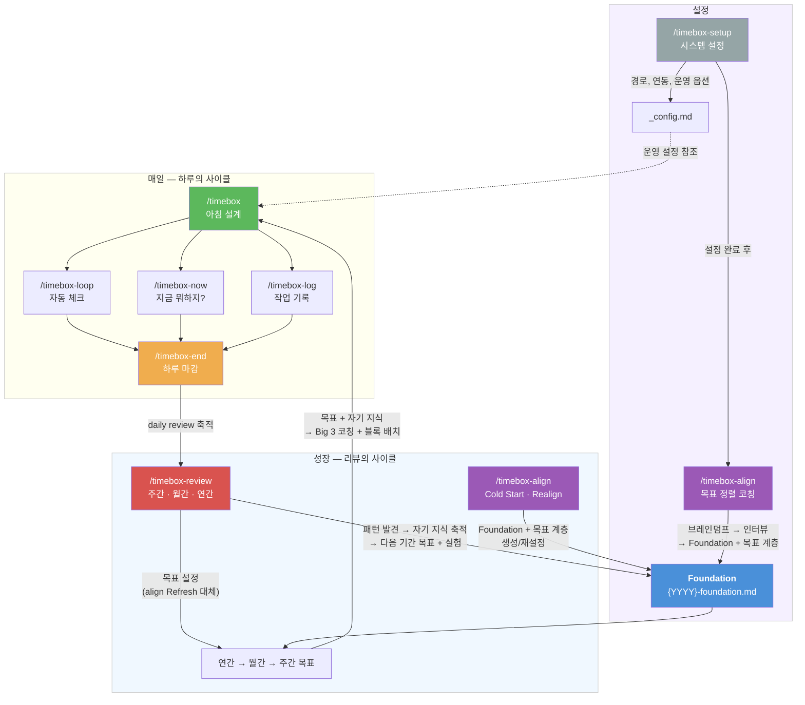

# Timebox

**목표 정렬 + 시간 블록 + 자기 지식의 닫힌 루프.**

시간이 가장 비싼 자원인 건 알겠는데, 막상 관리하려면 쉽지 않죠. 할 일 목록은 계속 길어지고, 하루가 끝나면 "바빴는데 뭘 했지?" 하는 경험, 한 번쯤 있을 거예요.

Timebox는 이걸 도와주는 시스템이에요. **"뭘 하지?"가 아니라 "이 시간에 이 결과를 낸다"로 하루를 설계하고, 매일 기록하고, 매주 패턴을 발견하고, 그 패턴이 다음 날의 플랜을 더 정확하게 만들어줍니다.** 쓸수록 나에게 맞춰지는 시스템이에요.

---

## 철학: 시스템이 나를 만든다

의지력은 유한해요. "내일부터 열심히 해야지"는 3일이면 무너지죠.

Timebox는 **의지력 대신 시스템**으로 움직여요. 핵심 아이디어는 세 가지:

**1. 목표는 계층이다** — 올해의 방향(Foundation)에서 월간, 주간, 오늘의 Big 3까지 하나의 선으로 연결돼요. 오늘 하루가 올해의 방향에 기여하고 있는지, 항상 확인할 수 있어요. `/timebox-align`이 이 계층을 세우고 다듬어요.

**2. 하루는 블록이다** — "오늘 뭐 하지?"가 아니라 "9시에 이것, 11시에 저것, 끝나면 확인"이에요. 결정 피로를 줄이고, 시간에 결과를 매핑해요. `/timebox`가 매일 아침 이걸 설계하고, `loop`·`now`·`log`가 하루를 함께 걸어가요.

**3. 기록이 나를 가르친다** — 매일 쌓이는 데이터에서 패턴이 보여요. "오전에 집중 잘 됨", "문서 작업은 2배 걸림" 같은 사실들. 이 자기 지식이 Foundation에 축적되고, 다음 날의 블록 배치를 더 정확하게 만들어요. `/timebox-review`가 패턴을 발견하고, `/timebox-align`이 목표를 조정해요.

결국 Timebox는 **"나"라는 시스템을 만들어가는 도구**예요. Claude가 코치로서 목표를 깎아주고, 데이터를 분석해주고, 패턴을 짚어주지만 — 결정은 항상 당신이 해요. 시스템은 당신을 대신하지 않아요. 당신이 더 잘 결정할 수 있게 도와줄 뿐이에요.

---

## 왜 Big 3인가?

할 일이 10개 있어도, 오늘 진짜 중요한 건 3개 이하일 거예요. 나머지는 "하면 좋은 것"이죠.

그리고 Big 3는 **Task가 아니라 Outcome**이에요:

| Task (작업) | Outcome (결과) |
|-------------|----------------|
| API 코드 리뷰한다 | API 리뷰 완료 + 승인 상태 |
| 버그 조사한다 | 버그 원인 특정 + 수정 PR 올린 상태 |
| 문서 작업한다 | 온보딩 문서 v1 팀 공유 완료 |

차이가 뭐냐면 — Task는 "했다"이고, Outcome은 **"됐다"**예요.

"코드 리뷰한다"는 2시간 보고도 "아직 다 못 봤는데..." 할 수 있잖아요. 반면 "리뷰 완료 + 승인"은 됐거나 안 됐거나 둘 중 하나예요. **끝이 명확해야 끝낼 수 있어요.**

그래서 Timebox는 Big 3를 정할 때 꽤 악착같이 물어봐요:
- "이걸 끝냈을 때, 세상에 뭐가 달라져 있어요?"
- "'됐다'를 30초 안에 확인할 수 있어야 해요. 어떻게 확인하죠?"
- "이 시간에 할 수 있는 가장 임팩트 있는 일이 정말 이건가요?"

두리뭉술하면 통과 못 해요. 당신의 시간이니까요.

---

## 시스템 아키텍처



**세 개의 층** — setup으로 시스템을 세우고, 매일의 사이클이 데이터를 만들고, 리뷰의 사이클이 나를 바꿉니다.

**데이터 흐름:**
- `/timebox`가 Foundation + 목표를 읽어 Big 3 코칭 + 블록 배치
- `/timebox-end`가 하루 리뷰를 생성 (오늘/내일을 위한 기록)
- `/timebox-review`가 리뷰 데이터를 분석하여 패턴 발견 → Foundation 자기 지식 축적 + 다음 기간 목표 설정
- Foundation의 자기 지식(에너지 패턴, 추정 정확도 등)이 다음 `/timebox`의 블록 배치에 반영

---

## 커맨드

### `/timebox-setup` — 시스템 설정

최초 1회 실행. 이후 설정 변경 시에만 재실행.

- 데이터 경로 설정 (`$TIMEBOX_HOME`)
- `_config.md` 생성 (체크인 주기, 블록 길이, 연동 설정)
- 쉘 프로필에 환경변수 자동 추가

### `/timebox-align` — 목표 정렬 코칭

"나"라는 시스템을 설계하는 대화형 코칭.

| 모드 | 트리거 | 동작 |
|------|--------|------|
| **Cold Start** | Foundation 없음 | 브레인덤프 → 인터뷰 → Foundation + 연간/월간/주간 목표 생성 |
| **Refresh** | 주간 목표가 지난 주 이전 | 지난주 리뷰 기반 이번 주 목표 설정 (review의 fallback) |
| **Realign** | 사용자가 방향 전환 요청 | Foundation부터 재검토, 변경 부분만 Edit |

- Foundation에서 연간 → 월간 → 주간까지 Parent-Child 정렬 강제
- 용량 초과 시 즉시 경고 ("목표가 가용 블록을 초과합니다")
- `/timebox-review`에서 이미 목표를 세웠으면 Refresh는 확인만

### `/timebox` — 아침 설계

매일 아침 Big 3를 정하고 시간 블록으로 배치.

**흐름:** 목표 로드 → 브레인덤프 → 분류 + 목표 연결 → **아웃컴 검증** → 시간 블록 배치 → 마스터 파일 생성 → 체크인 루프 시작

**아웃컴 검증** — 모호한 Big 3 후보에 적용:
1. "이걸 끝냈을 때, 세상에 뭐가 달라져 있어요?"
2. "'됐다'를 30초 안에 확인할 수 있어야 합니다."
3. "이 시간에 할 수 있는 가장 임팩트 있는 일이 정말 이건가요?"
4. 3일+ carry-over → 회피 탐지

**추정 정확도 보정** — Foundation에 데이터가 있으면 과거 정확도를 대조하여 블록 수 조정 제안.

**출력:** `plans/{YYYY-MM-DD}.md` (Big 3 + Schedule + Energy Log)

### `/timebox-loop` — 자동 블록 알림

`/loop 5m /timebox-loop`으로 사용. **질문 없이 출력만.**

- 현재 블록 + 다음 할 일을 Content-first로 표시
- 블록 종료 5분 전 / 블록 전환 / 시간 초과 알림
- 코치 한마디: 상황 인식형 넛지(50%), 작업 맞춤형(20%), 거장의 지혜(15%), 팩폭(15%)
- 방향 이탈 감지 (Deep Work 시간에 Big 3 외 작업 시)

**읽는 파일:** 마스터 플랜(읽기 전용), 주간 목표, 최신 로그

### `/timebox-now` — 지금 뭐하지?

회의 다녀왔거나 문득 "나 지금 뭐해야 하지?" 할 때. **대화형 체크인.**

> loop는 자동 알림(출력만), now는 대화형 체크인(AskUserQuestion 사용).

- 현재 블록 + 진행률 표시
- 빠른 체크인: 순조/막힘/블록 연장/일찍 끝남
- 에너지 로그 기록 (선택)
- 방향 이탈 감지 + ad-hoc 카운트 경고

### `/timebox-log` — 작업 기록

현재 세션의 작업을 로그로 남기고, 마스터 파일 체크리스트 갱신.

- 이벤트 분류: `deep-work` / `interrupt` / `switch` / `ad-hoc` / `break` / `shallow`
- 목표 연결 (`related_to`): Big 3 항목 또는 주간/월간 목표
- 에너지 레벨 기록 (로그 + 마스터 파일 Energy Log 테이블)
- 코치 피드백: 이벤트 타입 + 에너지 + 하루 맥락을 종합한 개인화 메시지

**출력:** `logs/{YYYY-MM-DD}/{HHmm}-timebox-{타입}.md`

### `/timebox-end` — 하루 마감

> end는 오늘과 내일을 위한 기록. 패턴 분석과 시스템 피드백은 `/timebox-review`의 역할.

**흐름:** 체크인 루프 해제 → 데이터 수집 → Big 3 리뷰 → 블록 분석 → 에너지 패턴 → 목표 정렬 → 리플렉션 → Review 파일 생성 → Git 커밋

- **Estimation Accuracy**: 각 Big 3의 예상 블록 vs 실제 소요 블록 (로그의 `related_to` 매칭으로 산출)
- **Carry Forward**: 미완료 Big 3 → 이월/분해/드롭 선택
- **회고 2단 구조**: Reflection(사용자 원문 그대로) + Coach's Notes(팩트 기반 + When-Then + 질문)
- **Git 자동 커밋**: `_config.md`의 `github_sync: on`이면 push까지

**출력:** `reviews/{YYYY-MM-DD}-timebox-review.md`

### `/timebox-review` — 패턴 리뷰

```
/timebox-review              → 주간 (기본)
/timebox-review monthly      → 월간
/timebox-review yearly       → 연간
```

> review는 패턴을 파악해서 시스템을 만들고 피드백하기 위함. 목표가 변경될 수 있고, 이 패턴을 바탕으로 하루의 일과를 정할 때 참고.

**Phase 1 (분석 + 회고):**
- 성과 요약 (Big 3 달성률, 블록 준수율)
- 패턴 분석: 인터럽트, 회피, 에너지, 추정 정확도, 성과 조건
- 목표 정렬 분석
- 사용자 회고 (원문 보존) + Coach's Notes (When-Then + 질문)

**Phase 2 (목표 + Foundation + 실험):**
- 다음 기간 목표 생성 (`/timebox-align` Refresh를 대체)
- **Foundation 자기 지식 업데이트**: 2회+ 반복 패턴 → 축적, 실험 효과 → 검증된 전략 승격
- **실험 설계**: 한 기간 1개, 구체적이고 관찰 가능, 성공 기준 명시

**출력:** `reviews/{YYYY}-W{WW}-weekly-review.md` 등 + 목표 파일 + Foundation 업데이트

---

## Foundation

연도별 파일로 관리: `goals/{YYYY}-foundation.md`

미래에 `2026-foundation.md`를 돌아보면 그 해의 목표, 패턴, 시스템을 알 수 있습니다.

| 층 | 섹션 | 변경 주기 |
|----|------|-----------|
| **정적** | 방향, 역할, 제약, 유지선, 안 할 것 | 큰 방향 전환 시 (`/timebox-align`) |
| **성장** | 에너지 패턴, 몰입 조건, 회피 트리거, 추정 정확도, 검증된 전략, 성장 로그 | 리뷰할 때마다 (`/timebox-review`) |

정적 층은 이직이나 방향 전환 시 갈아끼우지만, **성장 층은 그대로 남습니다.** 회사가 바뀌어도 "오전에 집중 잘 됨", "문서 작업은 2배로 잡아야 함" 같은 건 나에 대한 사실이니까요.

---

## 회고 구조

| 레이어 | 누가 쓰나 | 역할 |
|--------|-----------|------|
| **Reflection** | 사용자 | 원문 그대로 보존. 정리/요약/교정하지 않음 |
| **Coach's Notes** | Claude | 핵심 요약 + 패턴 연결 + When-Then + 질문 |

- Daily(`/timebox-end`): 가벼운 한줄평 + Coach 2-3줄
- Weekly/Monthly(`/timebox-review`): 데이터 기반 질문 + Coach 5-10줄 + 패턴 연결

---

## 데이터 구조

```
$TIMEBOX_HOME/
├── _config.md                    # 시스템 설정 (/timebox-setup)
├── goals/
│   ├── {YYYY}-foundation.md      # 방향 + 자기 지식 (/timebox-align, /timebox-review)
│   ├── {YYYY}.md                 # 연간 목표
│   ├── {YYYY-MM}.md              # 월간 목표
│   └── {YYYY}-W{WW}.md           # 주간 목표 + 실험
├── plans/
│   └── {YYYY-MM-DD}.md           # 일간 Big 3 + 블록 스케줄 + Energy Log
├── logs/
│   └── {YYYY-MM-DD}/
│       └── {HHmm}-timebox-{타입}.md  # 블록별 작업 로그
└── reviews/
    ├── {YYYY-MM-DD}-timebox-review.md  # 일간 리뷰 (/timebox-end)
    ├── {YYYY}-W{WW}-weekly-review.md   # 주간 패턴 리뷰
    ├── {YYYY-MM}-monthly-review.md     # 월간 리뷰
    └── {YYYY}-yearly-review.md         # 연간 리뷰
```

---

## 설치

Claude Code에서 `/install` 명령으로 플러그인 마켓플레이스를 열고, 아래 저장소 URL을 등록하면 가장 편합니다:

```
https://github.com/bingl2/llm-tools.git
```

또는 직접 클론:

```bash
git clone https://github.com/bingl2/llm-tools.git
```

설치 후 첫 실행:

```bash
/timebox-setup    # 시스템 설정
/timebox-align    # 목표 정렬
/timebox          # 오늘 하루 설계
```

## 기여

좋은 아이디어, 개선 제안, 버그 리포트 모두 환영합니다. [PR](https://github.com/bingl2/llm-tools/pulls)이나 [Issue](https://github.com/bingl2/llm-tools/issues)로 남겨주시면 적극 반영하겠습니다.

## 설정

| 설정 | 기본값 | 관리 |
|------|--------|------|
| `$TIMEBOX_HOME` | `~/timebox` | 환경변수 (`/timebox-setup`) |
| 체크인 주기 | 5분 | `_config.md` |
| Deep Work 블록 | 90분 | `_config.md` |
| Break | 15분 | `_config.md` |
| GitHub 연동 | off | `_config.md` |
| Google Calendar | off | `_config.md` |
