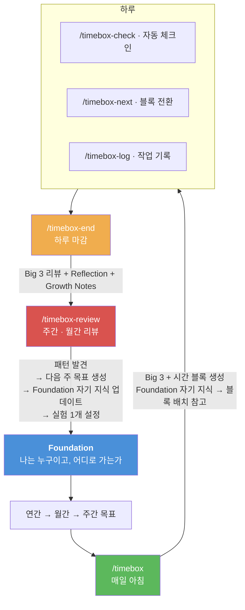

# Timebox

**목표 정렬 + 시간 블록 + 자기 지식의 닫힌 루프.**

시간이 가장 비싼 자원인 건 알겠는데, 막상 관리하려면 쉽지 않죠. 할 일 목록은 계속 길어지고, 하루가 끝나면 "바빴는데 뭘 했지?" 하는 경험, 한 번쯤 있을 거예요.

Timebox는 이걸 도와주는 시스템이에요. **"뭘 하지?"가 아니라 "이 시간에 이 결과를 낸다"로 하루를 설계하고, 매일 기록하고, 매주 패턴을 발견하고, 그 패턴이 다음 날의 플랜을 더 정확하게 만들어줍니다.** 쓸수록 나에게 맞아가는 시스템이에요.

---

## 왜 Big 3인가?

할 일이 10개 있어도, 오늘 진짜 중요한 건 3개 이하일 거예요. 나머지는 "하면 좋은 것"이죠.

그리고 Big 3는 **Task가 아니라 Outcome**이에요:

| Task (작업) | Outcome (결과) |
|-------------|----------------|
| API 코드 리뷰한다 | API 리뷰 완료 + 승인 상태 |
| 버그 조사한다 | 버그 원인 특정 + 수정 PR 올린 상태 |
| 문서 작업한다 | 온보딩 문서 v1 팀 공유 완료 |

차이가 뭐냐면 — Task는 "했다"이고, Outcome은 **"됐다"**예요.

"코드 리뷰한다"는 2시간 보고도 "아직 다 못 봤는데..." 할 수 있잖아요. 반면 "리뷰 완료 + 승인"은 됐거나 안 됐거나 둘 중 하나예요. **끝이 명확해야 끝낼 수 있어요.**

그래서 Timebox는 Big 3를 정할 때 꽤 악착같이 물어봐요:
- "이걸 끝냈을 때, 세상에 뭐가 달라져 있어요?"
- "'됐다'를 30초 안에 확인할 수 있어야 해요. 어떻게 확인하죠?"
- "이 시간에 할 수 있는 가장 임팩트 있는 일이 정말 이건가요?"

두리뭉술하면 통과 못 해요. 당신의 시간이니까요.

---

## 시스템 전체 그림


> **닫힌 루프** — 리뷰가 다음 날을 바꾼다

리뷰를 할수록 Foundation의 "자기 지식"이 두꺼워지고, 매일 `/timebox`가 그걸 읽어서 블록을 배치해요. **시스템을 쓸수록 시스템이 나에게 맞아가요.**

---

## 최아무개씨의 4주 — 처음부터 끝까지

> 최아무개씨. 3년차 백엔드 개발자. 스타트업에서 일하고 있고, 6개월 내 시니어 승급을 목표로 하고 있다. 문제: 매일 바쁜데 정작 중요한 일은 못 끝낸다. 코드 리뷰, 슬랙, 미팅에 시간이 녹는다.

### Week 0: 처음 세팅

```
/timebox-init
```

대화형 인터뷰가 시작된다. 먼저 쏟아내라고 한다:

```
Claude: "올해나 요즘 중요하다고 느끼는 것들을 정리되지 않은 상태 그대로 쏟아내 주세요."

최아무개: "시니어 승급 받고 싶고, 결제 시스템 리팩토링 끝내야 하고,
         팀 온보딩 문서도 내가 써야 하는데 계속 미루고 있고,
         운동을 다시 시작하고 싶고, 사이드 프로젝트도 하고 싶어요."
```

Claude가 정리한다:

```
[내가 들은 핵심]
- 성장: 시니어 승급 (6개월 내)
- 유지: 결제 시스템 리팩토링, 팀 온보딩 문서
- 회복: 운동 재개

[비어 있는 부분]
- 시니어 승급의 구체적 기준은?
- 하루 중 실제 집중 가능한 시간은?

[다음 질문]
1. 시니어가 되려면 뭘 보여줘야 하나요?
2. 하루에 방해 없이 집중할 수 있는 시간은 몇 시간?
```

3-5턴의 대화 후, 4개 파일이 생성된다:

**`goals/_foundation.md`**
```markdown
# Foundation

## 방향
6개월 내 시니어 승급. 기술 리더십을 코드와 문서로 증명한다.

## 역할
- 백엔드 엔지니어 (결제팀): 결제 시스템 리팩토링 리드, 코드 리뷰

## 제약
- 일일 Deep Work 가용: ~3블록 (4.5시간)
- 주 2회 팀 미팅 (화, 목 오후)

## 유지선
- 코드 리뷰 응답 24시간 내
- 온콜 대응

## 안 할 것
- 사이드 프로젝트 (승급 전까지 보류)
- 새 기술 스택 도입 제안

## 운영
- 체크인 주기: 10분
- 주간 리뷰: 금요일 오후
- 월간 리뷰: 매월 1일
```

**`goals/2026.md`**
```markdown
# 2026 Goals

## Y1: 시니어 엔지니어 승급 (성장)
성공 기준: H1 프로모션 사이클에서 승급 확정
상태: 진행중

## Y2: 결제 시스템 안정화 (유지)
성공 기준: 결제 실패율 0.1% 이하 + 리팩토링 완료
상태: 진행중

## Y3: 주 3회 운동 루틴 (회복)
성공 기준: 3개월 연속 주 3회 유지
상태: 대기중
```

**`goals/2026-03.md`**
```markdown
# 2026-03 Monthly Goals

## M1: 결제 트랜잭션 분리 완료
Parent: Y2
완료 기준: 트랜잭션 분리 PR 머지 + 스테이지 검증 통과
상태: 진행중

## M2: 팀 온보딩 문서 v1 완성
Parent: Y1
완료 기준: 문서 팀 리뷰 완료 + Confluence 게시
상태: 진행중
```

**`goals/2026-W13.md`**
```markdown
# 2026-W13 Weekly Goals

기간: 3/24 ~ 3/28

## W1: 결제 트랜잭션 분리 — 읽기/쓰기 경로 분리 PR
Parent: M1
상태: 진행중

## W2: 온보딩 문서 — 결제 플로우 섹션 초안
Parent: M2
상태: 대기중

## W3: 코드 리뷰 백로그 0건 유지
Parent: 유지
상태: 진행중
```

이제 목표 계층이 세워졌다. 모든 하위 목표가 상위에 `Parent:`로 연결되어 있다.

---

### Week 1 Day 1 (월요일): 첫 하루

#### 아침 — `/timebox`

```
Claude: "이번 달 목표는 [트랜잭션 분리, 온보딩 문서]이고,
        이번 주 focus는 [읽기/쓰기 경로 분리 PR]입니다.
        이 맥락에서 오늘을 설계해봅시다.
        머릿속에 있는 것들을 전부 쏟아내주세요."

최아무개: "트랜잭션 분리 계속 해야 하고, 코드 리뷰 3개 밀려있고,
         오후에 팀 미팅 있고, 슬랙에 질문 몇 개 답해야 하고,
         온보딩 문서도 좀 써야 하는데..."
```

Claude가 분류한다:

```
Outcome (Big 3 후보):
- 트랜잭션 읽기 경로 분리 완료 + 테스트 통과 [W1]
- 온보딩 문서 결제 플로우 섹션 초안 [W2]

Task (서브태스크):
- 코드 리뷰 3건 처리 → Shallow 블록
- 슬랙 질문 답변 → Shallow 블록

Maintenance:
- 팀 미팅 (14:00-15:00)
```

**여기서 악랄한 질문이 시작된다:**

```
Claude: "트랜잭션 읽기 경로 분리 완료 — 이걸 끝냈을 때 뭐가 달라져 있어요?"

최아무개: "읽기 쿼리가 레플리카로 가게 되죠."

Claude: "'됐다'를 30초 안에 확인할 수 있어야 합니다. 어떻게 확인하죠?"

최아무개: "음... 테스트 통과 + 로컬에서 레플리카 라우팅 확인?"

Claude: "좋습니다. 'PR 올릴 수 있는 상태'까지가 오늘 범위인가요,
        '머지'까지인가요? Deep Work 3블록(4.5시간)에 들어가야 합니다."

최아무개: "PR 올리는 것까지요."

Claude: "확인. Big 3:
        1. 트랜잭션 읽기 경로 분리 — PR 올린 상태 (~2블록)
        2. 온보딩 문서 결제 플로우 초안 — 팀 슬랙에 공유한 상태 (~1블록)
        합계 3블록 = 가용 3블록. 딱 맞습니다.
        이 2개를 해내면, 주간 목표 W1/W2에 확실히 기여하는 하루입니다."
```

생성되는 **`plans/2026-03-24.md`**:
```markdown
# 2026-03-24 (월요일) Timebox

## Big 3
1. [ ] 트랜잭션 읽기 경로 분리 — PR 올린 상태 (~2블록)
2. [ ] 온보딩 문서 결제 플로우 초안 — 팀 슬랙 공유 (~1블록)

## Schedule

### 09:30-11:00 | Deep Work
**Focus**: Big 3 #1 — 트랜잭션 읽기 경로 분리
- [ ] 읽기 쿼리 레플리카 라우팅 구현
- [ ] 기존 테스트 수정

### 11:00-11:15 | Break
> 체크인: 집중도? 다음 블록 조정?

### 11:15-12:30 | Deep Work
**Focus**: Big 3 #1 계속
- [ ] 통합 테스트 작성
- [ ] PR 작성

### 12:30-13:30 | Lunch

### 13:30-14:00 | Shallow Work
- [ ] 코드 리뷰 3건
- [ ] 슬랙 답변

### 14:00-15:00 | Meeting
- 팀 주간 미팅

### 15:00-16:30 | Deep Work
**Focus**: Big 3 #2 — 온보딩 문서
- [ ] 결제 플로우 다이어그램
- [ ] 핵심 코드 경로 설명
- [ ] 팀 슬랙 공유

### 16:30-17:00 | Flex
> 미완료 캐치업

### 17:00-17:30 | Wrap-up
> /timebox-end로 마감

## Energy Log
| Time | Energy | Notes |
|------|--------|-------|

## Notes
```

---

#### 하루 중간 — 블록 전환과 기록

**11:00 Break — `/timebox-next`**

```
Claude: "[Deep Work 1] 종료. Big 3 #1 진행 상황:
        - [x] 읽기 쿼리 레플리카 라우팅 구현
        - [ ] 기존 테스트 수정
        에너지는 1-5 중 어떤가요?"

최아무개: "4. 집중 잘 됐어."

Claude: "다음 [Deep Work 2]에서 테스트 수정 + PR 작성입니다.
        자리에서 일어나세요. 물 한 잔, 기지개."
```

**15:30 — ad-hoc 발생, `/timebox-log`**

```
Claude: "현재 [Deep Work 3] 블록인데, 작업 내용이 Big 3 #2가 아닌
        장애 대응이네요. 기록합니다."
```

생성되는 **`logs/2026-03-24/1530-timebox-ad-hoc.md`**:
```markdown
# 15:30 Ad-hoc Log

## Block Info
- Planned: Deep Work 3 — 온보딩 문서
- Actual: 결제 타임아웃 장애 대응

## Event
- type: ad-hoc
- related_to: 유지/운영
- energy: 3/5
- trigger: Slack 장애 알림

## Work Done
- 결제 타임아웃 원인 분석 (DB 커넥션 풀 고갈)
- 임시 커넥션 풀 증설 적용

## Status
- Big 3 #1: [x] PR 올림 (2블록 사용, 계획 일치)
- Big 3 #2: [ ] 미착수 (장애로 밀림)
```

---

#### 하루 마감 — `/timebox-end`

```
Claude: "Big 3 냉정한 리뷰:
        1. [x] 트랜잭션 읽기 경로 분리 PR — 완료
        2. [ ] 온보딩 문서 — 미착수 (장애 대응으로 밀림)

        Success Rate: 1/2
        Block Adherence: 2/3 (67%)

        이월할까요, 드롭할까요?"

최아무개: "이월. 내일 첫 블록에 할게."

Claude: "오늘 한 줄로 정리하면?"

최아무개: "장애 때문에 문서 못 했지만, 본업인 트랜잭션 분리는 끝냈다."
```

생성되는 **`reviews/2026-03-24-timebox-review.md`**:
```markdown
# 2026-03-24 (월요일) Timebox Review

## Big 3 Results
1. [x] 트랜잭션 읽기 경로 분리 PR — 완료
2. [ ] 온보딩 문서 결제 플로우 초안 — 미착수

Success Rate: 1/2

## Block Analysis
| Block | Plan | Actual | Match |
|-------|------|--------|-------|
| 09:30-11:00 Deep 1 | 트랜잭션 분리 | 트랜잭션 분리 | O |
| 11:15-12:30 Deep 2 | 트랜잭션 분리 | 트랜잭션 분리 + PR | O |
| 13:30-14:00 Shallow | 코드리뷰/슬랙 | 코드리뷰 2건 | △ |
| 15:00-16:30 Deep 3 | 온보딩 문서 | 장애 대응 | X (ad-hoc) |

Block Adherence: 2/3 Deep Work (67%)

## Energy Pattern
- Peak: 09:30-12:30 (오전 연속 몰입)
- Low: 15:00 이후 (장애 대응 후 소진)

## Goal Alignment
- 목표 직접 기여: 2블록 — 트랜잭션 분리 [M1]
- 유지/운영: 1블록 — 장애 대응
- 예상 밖: 1블록 — 장애

## Carry Forward
### 내일 Big 3 후보
1. 온보딩 문서 결제 플로우 초안 (carry-over)
2. 트랜잭션 쓰기 경로 분리 착수 [W1]

## Daily One-liner
> 장애 때문에 문서 못 했지만, 본업인 트랜잭션 분리는 끝냈다.

## Reflection
장애 때문에 문서 못 했지만, 본업인 트랜잭션 분리는 끝냈다.
오전에 연속으로 몰입한 게 좋았고, 장애 대응은 어쩔 수 없었다.

## Coach's Notes
오전 연속 2블록 몰입으로 트랜잭션 분리를 끝낸 건 이번 주 가장 좋은 집중이었다.
장애 대응은 불가피했지만, 온보딩 문서가 이틀째 밀리고 있다.
> When-Then: 내일 온보딩 문서가 Big 3에 올라오면, 첫 블록에 "30분만 뼈대 잡기"로 시작한다.
> 질문: 문서 작업이 계속 밀리는 건 시간 문제인가, "쓰기 시작"이 어려운 건가?
```

---

### Week 1 금요일: 주간 리뷰

```
/timebox-review
```

5일간 데이터가 쌓였다. Claude가 패턴을 분석한다:

```
## 성과 요약
- Big 3 달성률: 8/12건 (67%)
- 블록 준수율: 평균 72%
- 추이: 월~수 상승, 목~금 하락

## 패턴 분석

### 에너지 패턴
- Peak: 09:30-12:30 (5/5일 일치)
- Low: 15:00-16:00 (점심 후 슬럼프)
- "오전에 Big 3 중 가장 어려운 일 배치" 전략 유효

### 회피 패턴
- 온보딩 문서: 3일 carry-over → 4일째 드롭 후 재설정
- 패턴: "급하지 않은 중요한 일"을 미루는 경향

### 추정 정확도
- 평균 1.4배 초과 (1블록 추정 → 실제 1.4블록)
- 특히 문서 작업 과소추정 (1블록 → 2블록)
```

**4단계 — 사용자 회고:**

Claude가 패턴을 짚어 질문한다:

```
Claude: "온보딩 문서를 3일 연속 미뤘는데, 시간이 부족했던 건가요
        아니면 '쓰기 시작'이 어려웠던 건가요?
        이번 주를 돌아보며 느낀 점이 있으면 자유롭게 남겨주세요."

최아무개: "솔직히 시간 문제는 아니었던 것 같아요. 코딩은 바로 시작하는데
         문서는 뭘 써야 할지 막막해서 자꾸 미루게 되더라고요.
         오전에 집중 잘 되는 건 확실히 느꼈고, 장애 대응도 결국
         해내긴 했는데... 문서를 못 끝낸 게 계속 찝찝합니다."
```

생성되는 리뷰 파일의 회고 부분:
```markdown
## Reflection
솔직히 시간 문제는 아니었던 것 같아요. 코딩은 바로 시작하는데
문서는 뭘 써야 할지 막막해서 자꾸 미루게 되더라고요.
오전에 집중 잘 되는 건 확실히 느꼈고, 장애 대응도 결국
해내긴 했는데... 문서를 못 끝낸 게 계속 찝찝합니다.

## Coach's Notes
"시간 문제가 아니라 시작이 어렵다"는 자각이 이번 주 가장 큰 발견이다.
코딩(구조가 명확) vs 문서(백지 상태)의 차이를 본인이 인식했다.
오전 몰입 패턴은 5/5일 일치로 확정적 — 이건 Foundation에 올릴 수준.
> When-Then: 다음에 문서 작업이 Big 3에 오르면, 시작 전 "목차 3개만 적기"를 첫 액션으로 둔다.
> 질문: 코딩은 왜 바로 시작할 수 있는가? 그 조건을 문서에도 만들 수 있는가?
```

**7단계 — 다음 주 목표 생성:**

```
Claude: "리뷰 결과를 바탕으로 W14 목표를 제안합니다:

W1: 트랜잭션 쓰기 경로 분리 PR (Parent: M1) — 이번 주 읽기 완료 기반
W2: 온보딩 문서 v1 완성 + Confluence 게시 (Parent: M2) — 3주째. 이번 주 반드시.
W3: 코드 리뷰 백로그 0건 유지 (Parent: 유지)

이 목표들로 다음 주를 시작할까요?"
```

**8단계 — Foundation 자기 지식 업데이트:**

`_foundation.md`에 추가:
```markdown
## 자기 지식

### 에너지 패턴
- 오전 몰입형: 09:30-12:30이 최고 집중 시간대 (W13: 5/5일 일치)
- 오후 슬럼프: 15:00-16:00 집중력 저하 (W13: 4/5일)

### 몰입 조건
- 오전 첫 블록에 어려운 일 배치 → 완료율 높음

### 회피 트리거
- "급하지 않은 중요한 일"(문서 등)을 미루는 경향 (W13: 온보딩 문서 3일 carry-over)

### 추정 정확도
- 코딩 작업: 1.2x (거의 정확)
- 문서 작업: 2.0x (1블록 잡으면 2블록 걸림)

### 검증된 전략
- (아직 없음 — 첫 실험 후 축적)
```

**9단계 — 실험 설계:**

```
이번 주 실험:
- 실험: 오후 슬럼프(15:00) 시간에 Deep Work 대신 Shallow 배치
- 근거: W13 에너지 패턴 — 15:00-16:00 집중력 저하 5일 중 4일
- 성공 기준: 5일 중 3일 이상 15:00 블록을 Shallow로 운영
- 기록: timebox-end 시 15:00 블록 타입 확인
```

---

### Week 2: 실험이 적용된 하루

다음 주 월요일 `/timebox` 실행 시:

```
Claude: (Foundation 자기 지식을 읽고)
"에너지 패턴에 따르면 09:30-12:30이 최고 집중 시간입니다.
가장 어려운 Big 3를 오전에 배치합니다.

15:00-16:00은 슬럼프 시간대이고, 이번 주 실험으로
이 시간에 Shallow를 배치합니다.

참고: 문서 작업은 추정의 2배가 걸리는 경향이 있습니다.
1블록이 아니라 2블록으로 잡겠습니다."
```

Foundation의 자기 지식이 블록 배치에 직접 반영된다. 시스템이 나에게 맞아가기 시작한다.

---

### Week 4: 월간 리뷰

```
/timebox-review monthly
```

4주 누적 데이터:

```
## 이달의 검증된 전략

실험 "15:00 Shallow 배치":
- W14: 3/5일 실행, 블록 준수율 78% → 82% 상승
- W15: 5/5일 실행, 오후 블록 이탈 0건
- 판정: 효과 있음 → Foundation 승격
```

Foundation `검증된 전략`에 추가:
```markdown
### 검증된 전략
- 15:00 Shallow 배치: 오후 슬럼프에 Deep Work 대신 Shallow 배치 시
  블록 준수율 +10%p (W14-W15 실험, 2주간 검증)
```

**이게 시스템이에요.** 패턴 발견 → 실험 → 검증 → Foundation 승격 → 매일 자동 적용. 4주 후의 최아무개씨는 4주 전보다 자기를 더 잘 아는 시스템 위에서 일하고 있어요.

---

## 회고의 구조: 2단 + When-Then

Timebox의 회고는 **2단 구조**예요:

| 레이어 | 누가 쓰나 | 역할 |
|--------|-----------|------|
| **Reflection** | 사용자 | 원문 그대로. 한 줄이든 한 페이지든. 절대 수정하지 않음 |
| **Coach's Notes** | Claude | 핵심 요약 + 패턴 연결 + When-Then + 질문 |

왜 이 구조인가?

- **날것의 기록**이 가장 가치 있어요. 3개월 뒤에 돌아보면, 정리된 요약보다 그때 느낀 감정이 더 많은 걸 알려줍니다.
- **Coach's Notes**는 요약과 분석을 하나로 합쳤어요. "뭐가 있었는지"와 "그래서 뭘 할 건지"가 한 곳에.
- **When-Then**("다음에 [상황]이 오면, [행동]한다")은 연구상 가장 강력한 행동 변화 도구예요. 단순 목표 설정보다 4~5배 효과적입니다.
- **질문 1개**는 다음 리뷰 때 더 깊이 생각할 씨앗이에요.

Daily(`/timebox-end`)와 Weekly/Monthly(`/timebox-review`)는 **깊이가 다릅니다**:

| | Daily | Weekly/Monthly |
|--|-------|----------------|
| 최소 입력 | 한줄평 | 한줄 총평 |
| 질문 | 1개 (가볍게) | 1-2개 (데이터 기반, 날카롭게) |
| Coach's Notes | 2-3줄 | 5-10줄 + 패턴 연결 |

귀찮은 날은 한 줄만 남기면 돼요. 하지만 할 말이 많은 날 — **그게 성장 포인트**예요.

---

## Foundation의 두 층

Foundation은 두 층으로 되어 있어요:

**상단 — 정적 층** (큰 축이 바뀔 때만 `/timebox-init Realign`으로 교체)
| 섹션 | 역할 |
|------|------|
| 방향 | 북극성. 모든 목표의 최상위 근거 |
| 역할 | 현재 맡고 있는 책임들 |
| 제약 | 시간/마감 등 변경 불가 조건 |
| 유지선 | 떨어뜨리면 안 되는 것 |
| 안 할 것 | 의도적으로 안 하기로 한 것 |
| 운영 | 체크인 주기, 리뷰 주기 |

**하단 — 성장 층** (리뷰할 때마다 자라남)
| 섹션 | 역할 |
|------|------|
| 에너지 패턴 | 언제 집중 잘 되고, 안 되는지 |
| 몰입 조건 | 어떤 조건에서 몰입하는지 |
| 회피 트리거 | 어떤 일을 미루는 경향이 있는지 |
| 추정 정확도 | 시간 추정이 얼마나 정확한지 |
| 검증된 전략 | 실험 → 효과 확인된 규칙들 |
| 성장 로그 | 핵심 자각/깨달음 기록 |

이직하거나 인생의 방향이 바뀌면 상단을 갈아끼워요. **하단은 그대로 남아요.** 회사가 바뀌어도 "오전에 집중 잘 됨", "문서 작업은 2배로 잡아야 함" 같은 건 나에 대한 사실이니까요.

---

## 커맨드 레퍼런스

| 커맨드 | 언제 | 하는 일 |
|--------|------|---------|
| `/timebox-init` | 처음 1회, 또는 큰 축 변경 시 | 목표 계층 세팅 (Foundation → 연간 → 월간 → 주간) |
| `/timebox` | 매일 아침 | Big 3 코칭 + 시간 블록 생성 + 체크인 루프 시작 |
| `/timebox-check` | 자동 (cron) | 현재 블록 상태 알림 |
| `/timebox-next` | 블록 전환 시 | 체크인 + 다음 블록 안내 + 에너지 기록 |
| `/timebox-log` | 작업 구간 끝 | 세션 기록 + Big 3 진행률 갱신 |
| `/timebox-end` | 하루 마감 | Big 3 리뷰 + Reflection + 내일 후보 |
| `/timebox-review` | 주간/월간/연간 | 패턴 분석 + 목표 업데이트 + Foundation 성장 + 실험 설계 |

## 하루의 흐름

```
/timebox-init     (한 번, 또는 큰 전환점에서)
  └→ /timebox     (매일 아침)
       ├→ /timebox-check  (자동, 설정한 주기마다)
       ├→ /timebox-next   (블록 전환할 때)
       ├→ /timebox-log    (작업 기록할 때)
       └→ /timebox-end    (하루 마감)
            └→ /timebox-review  (금요일 또는 기간 끝)
```

## 데이터 구조

```
$TIMEBOX_HOME/
├── goals/
│   ├── _foundation.md       # 방향 + 자기 지식 (시스템의 핵심)
│   ├── {YYYY}.md             # 연간 목표
│   ├── {YYYY-MM}.md          # 월간 목표
│   └── {YYYY}-W{WW}.md      # 주간 목표 + 실험
├── plans/
│   └── {YYYY-MM-DD}.md      # 일간 Big 3 + 블록 스케줄
├── logs/
│   └── {YYYY-MM-DD}/
│       └── {HHmm}-timebox-{타입}.md
└── reviews/
    ├── {YYYY-MM-DD}-timebox-review.md    # 일간 리뷰
    ├── {YYYY}-W{WW}-weekly-review.md     # 주간 패턴 리뷰
    ├── {YYYY-MM}-monthly-review.md       # 월간 리뷰
    └── {YYYY}-yearly-review.md           # 연간 리뷰
```

## 설치

```bash
# 플러그인 설치
claude plugin install timebox

# (선택) 데이터 경로 변경
export TIMEBOX_HOME=~/my-timebox   # 기본값: ~/timebox
```

## 설정

| 설정 | 기본값 | 설명 |
|------|--------|------|
| `$TIMEBOX_HOME` | `~/timebox` | 데이터 저장 경로 |
| 체크인 주기 | `_foundation.md`에서 설정 | `/timebox`에서 매일 조정 가능 |
| Deep Work 블록 | 90분 | 사용자 패턴에 따라 조정 |
| Break | 15분 | 종료 의식 포함 |
